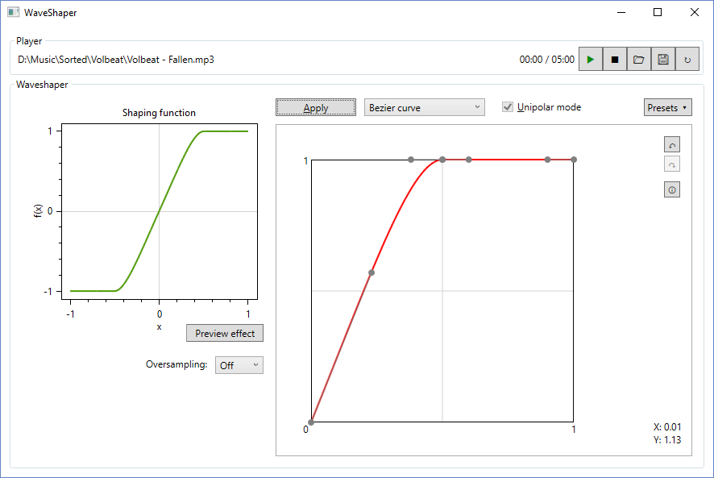
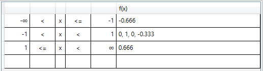

# WaveShaper

A software waveshaper that can transform a signal using an arbitrary shaping function.
The user can specify an arbitrary shaping function,
either by intuitively manipulating some Bezier curves representing the shaping function
or by specifying the mathematical definition of the shaping function.

## Waveshaping
A waveshaper works by changing the amplitude of a signal.
The amplitude of the output signal is determined by a _shaping (transfer) function_ in relation to the amplitude of the input signal.
Mathematically, the output signal `s(t)` is calculated as `s(t) = f(x(t))`,
where `f` is the shaping function, and `x(t)` is the input signal.
As the shaping function can be arbitrary a wide array of different effects can be implemented in this way.

An example of a shaping function. The input signal (left) is transformed by a soft-clipping shaping function (center) into the output signal (right).

## Features
- Load and play audio files (`.wav, .mp3, .aiff, ...`).
- "On the fly" waveshaping.
- Save waveshaping result to a `.wav` file.
- Arbitrary shaping functions. Can be specified by:
  - Bezier curves manipulation,
  - piecewise polynomials, or
  - piecewise functions.
- Shaping function visualisation.
- Undo/redo.
- Oversampling.

## Screenshots

The waveshaper and Bezier curves manipulation.  

Piecewise polynomial input.  

Piecewise function input.  

## Libraries
- [NAudio](https://github.com/naudio/NAudio)
- [Jace.NET](https://github.com/pieterderycke/Jace)
- [Math.NET Numerics](https://github.com/mathnet/mathnet-numerics)
- [Oxyplot](https://github.com/oxyplot/oxyplot)
- [Json.NET](https://github.com/JamesNK/Newtonsoft.Json)

